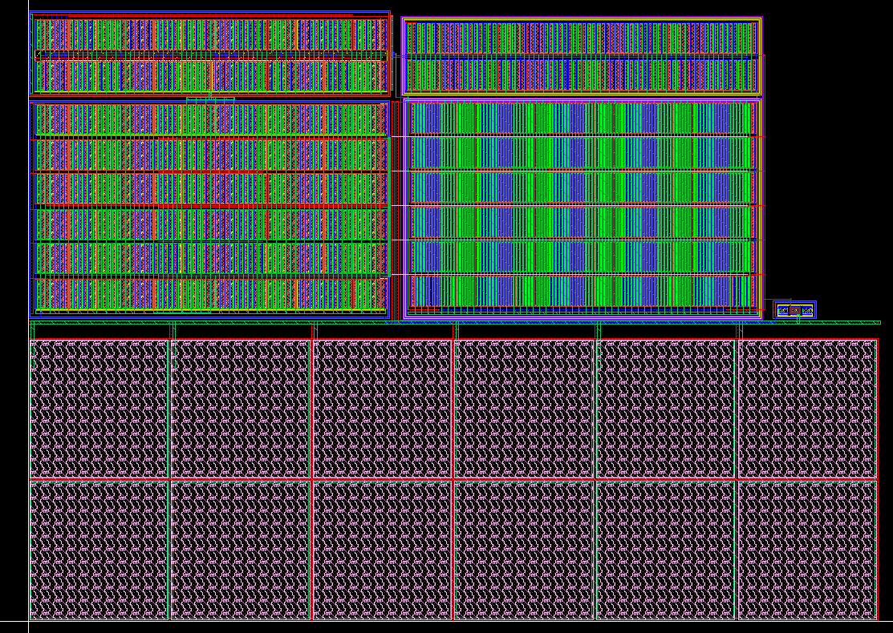
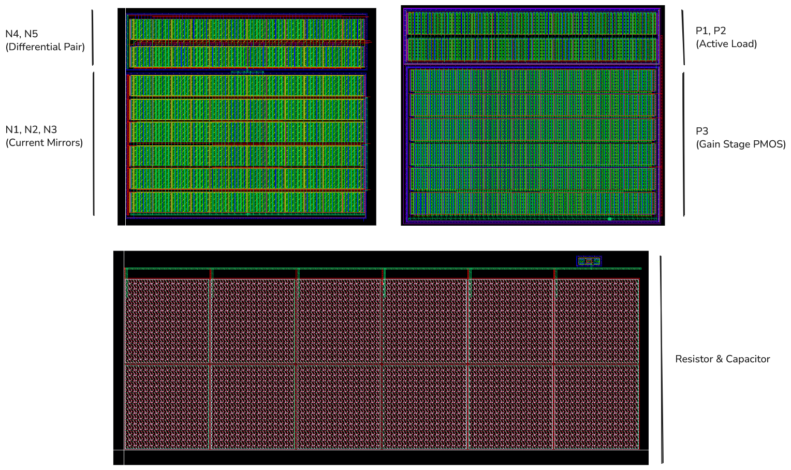

# 1-V, High-Gain, Wide-Bandwidth Two-Stage Op-Amp
In this repository, the basic theory, design, layout, and results of two stage differential Op-Amp are discussed.

## Design

**Figure 1: Circuit Design**

The OTA uses current mirror techniques, differential pairs with PMOS as the active load, Miller Compensation, a 600 µA current source, a supply voltage of $1V \pm 10\%$, and a common-source output stage.

The current source I1 flows through the diode-connected transistor N1, creating a reference voltage. This voltage is mirrored to N2, which provides a stable tail current for the differential pair (N4, N5).

N4 and N5 form an NMOS differential pair that converts the differential input voltage (Input+ − Input−) into differential currents. P1 and P2 form a PMOS current mirror active load, converting the differential currents into a single-ended output current. This stage provides high gain and converts voltage to current (transconductance, $g_{m}$).

P3 (PMOS) acts as a common-source amplifier driven by the first stage. N3 (NMOS) serves as the current source load for P3. This stage provides additional voltage gain and drives the output load.

R1 ($50~\Omega$) and C1 (585fF) form the compensation network connected between the output and the intermediate node. This creates a dominant pole to ensure stability by moving the dominant pole to lower frequencies, introducing a zero (nulling resistor R1) to cancel the RHP zero. C2 (10pF) represents the load capacitance that the OTA must drive.

**Table 1: Transistor Dimensions**

| Name | Purpose                          | L (nm) | W_finger (um) | Multiplier | Fingers |
|------|----------------------------------|--------|---------------|------------|---------|
| N1   | Current Mirror                   | 500    | 5             | 8          | 6       |
| N2   | Tail Current Source              | 500    | 5             | 12         | 6       |
| N3   | Gain Stage NMOS                  | 500    | 5             | 52         | 6       |
| N4   | Input Differential Pair (-)      | 500    | 5             | 12         | 6       |
| N5   | Input Differential Pair (+)      | 500    | 5             | 12         | 6       |
| P1   | Active Load PMOS                 | 500    | 5             | 12         | 6       |
| P2   | Active Load PMOS                 | 500    | 5             | 12         | 6       |
| P3   | Gain Stage PMOS                  | 250    | 5             | 100        | 6       |

**Table 2: OTA Performance Parameters**

| Parameter | Definition | Equation |
|----------|------------|----------|
| Gain (Av) | Ratio of output voltage change to input voltage change | $A_v = \frac{V_\text{out}}{V_\text{in}}$ |
| Unity-Gain Bandwidth (UGB) | Frequency where gain becomes 1; determines speed | $f_t \approx \frac{g_m}{C_L}$ |
| Phase Margin (PM) | Measure of feedback stability | $\text{PM} = 180^\circ + \text{phase(open-loop)}$ |
| Power Supply Rejection Ratio (PSRR) | Ability to reject supply variations | $\text{PSRR} = \frac{dV_\text{DD}}{dV_\text{out}}$ |
| Input-Referred Noise (vn) | Equivalent input noise producing observed output noise | $v_n \approx \frac{V_\text{out,noise}}{A_v}$ |
| Slew Rate (SR) | Maximum rate of change of output voltage | $\text{SR} = \frac{dV_\text{out}}{dt}$ |
| Power Consumption | Total power used by OTA | $P = V_\text{DD} \cdot I_\text{DD}$ |
| Offset Voltage (Vos) | Input voltage required to make output zero | $V_\text{os} = V_\text{in}^+ - V_\text{in}^-$ |
| Total Harmonic Distortion (THD) | Ratio of harmonic power to fundamental | $\text{THD} = \frac{V_2 + V_3 + \dots}{V_1} \cdot 100%$ |
| Input Common-Mode Range (ICMR) | Valid input common-mode voltage range | --- |

## Corner Cases Tested
To evaluate the robustness of the designed OTA, we tested it under a total of **90 corner cases**, including:

**Process Variations (5 cases):**
- FF: Fast NMOS / Fast PMOS
- FS: Fast NMOS / Slow PMOS
- SF: Slow NMOS / Fast PMOS
- SS: Slow NMOS / Slow PMOS
- NN: Nominal NMOS / Nominal PMOS

**Voltage Variations (3 cases):**
- Typical: $V_\text{DD} = 1~\text{V}$
- Low: $V_\text{DD} = 0.9~\text{V}$
- High: $V_\text{DD} = 1.1~\text{V}$

**Temperature Variations (3 cases):**
- Very low: $-40^\circ\text{C}$
- Nominal: $25^\circ\text{C}$
- Extremely high: $125^\circ\text{C}$

**Input Common-Mode Range (ICMR):**
- $0.3V_\text{DD}$ to $0.8V_\text{DD}$

## Pre-Layout Simulation Results

**Table 3: Nominal Values and Process Variation before Layout**

| Parameters | Nominal | FF | SS | FS | SF |
|-----------|--------|----|----|----|----|
| Gain (dB) | 61.82 | 61.25 | 62.43 | 61.79 | 61.72 |
| UGB (MHz) | 137.2 | 157.4 | 114.8 | 143.1 | 125.1 |
| Phase Margin (deg) | 60.48 | 55.93 | 63.86 | 56.2 | 63.88 |
| PSRR (dB) | -64.43 | -63.94 | -65.15 | -65.2 | -63.73 |
| Input Referred Noise (µV) | 915.1 | 926.9 | 889.3 | 869.2 | 982.3 |
| Total Power (mW) | 5.945 | 5.935 | 5.952 | 6.184 | 6.184 |
| Slew Rate (V/µs) | 120.6 | 136.8 | 106.7 | 118.4 | 120.6 |
| Offset (µV) | -74.5 | -164 | 37.41 | -173.5 | 41.54 |

---

**Table 4: Supply Voltage Variation before Layout**

| Parameters | VDD-10% | VDD+10% |
|-----------|----------|----------|
| Gain (dB) | 61.79 | 61.83 |
| UGB (MHz) | 135.4 | 138.8 |
| Phase Margin (deg) | 60.36 | 60.58 |
| PSRR (dB) | -64.33 | -64.48 |
| Input Referred Noise (µV) | 920.9 | 911.5 |
| Total Power (mW) | 5.251 | 6.653 |
| Slew Rate (V/µs) | 113.8 | 122.4 |
| Offset (µV) | -164.8 | -278.5 |

---

**Table 5: Temperature Variation before Layout**

| Parameters | -40°C | 125°C |
|-----------|--------|--------|
| Gain (dB) | 61.2 | 61.5 |
| UGB (MHz) | 161.8 | 112.4 |
| Phase Margin (deg) | 62.35 | 59.92 |
| PSRR (dB) | -63.72 | -64.22 |
| Input Referred Noise (µV) | 844.1 | 1002 |
| Total Power (mW) | 5.777 | 6.062 |
| Slew Rate (V/µs) | 122.9 | 118.1 |
| Offset (µV) | -219.6 | 78.61 |

---

**Table 6: ICMR Variation before Layout**

| Parameters | 0.3 × VDD | 0.8 × VDD |
|-----------|-----------|-----------|
| Gain (dB) | 62.11 | 59.91 |
| UGB (MHz) | 113.8 | 141.5 |
| Phase Margin (deg) | 59.2 | 60.79 |
| PSRR (dB) | -64.02 | -59.37 |
| Input Referred Noise (µV) | 948.2 | 857.7 |
| Total Power (mW) | 5.419 | 6.079 |
| Offset (µV) | -108.3 | -42.55 |

## Layout

The total area required for the layout is approximately 0.01566 mm².

**Figure 2: Layout of the Designed OTA**

**Figure 3: Placement of the MOSFETs**

